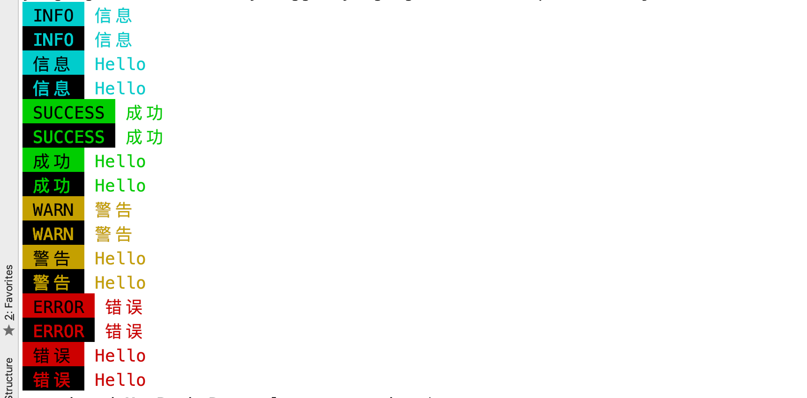

# y-logger
> node上控制台打印出颜色

## 使用

````js
	var Logger = require('../src');
	var log = new Logger();
	log.info('Hello');
````

具体参照`example/index.js`




## future

*	浏览器端的支持
*	webpack打包支持
*	自定义函数的支持
